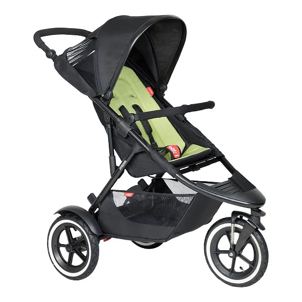

<style>
p {
  font-size: 15px;
}
</style>

```{r setup, include=FALSE}
knitr::opts_chunk$set(echo = FALSE)

library(tidyverse)
library(DBI)

searchinlist <- function(prestatement, list, poststatement) {
  last <- last(list)
  # list <- list[-length(list)]
  length(list) <- length(list)-1
  column <- last(str_split(prestatement, " ")[[1]])
  searchterms <- ""
  
  for (s in list) {
    searchterms <- str_c(searchterms, " like \'", s,"\' or ", column)
  }
  searchterms <- str_c(searchterms, " like \'", last, "\' ")
  
  query = str_c(prestatement, searchterms, poststatement)
  return(query)
}

conn <- dbConnect(RSQLite::SQLite(), "aol.sqlite", extended_types = TRUE)
```

## Frage 1: Wie viele eindeutige Nutzer suchten nach der E3?

```{r, cache = T, echo = F, warning = F}
query1aPrint <- searchinlist("SELECT count(distinct anonid) FROM aol_data where query", 
                             c('e3', 'e3 %', '% e3', '% e3 %'),
                             ";")

query1a <- searchinlist("SELECT * FROM aol_data where query",
                        c('e3', 'e3 %', '% e3', '% e3 %'),
                        "group by anonid, querytime;")

data_q1a <- dbGetQuery(conn, query1a)
anzahl_nutzer_e3_query <- data_q1a %>% select(AnonID) %>% unique() %>% nrow()

query1bPrint <- searchinlist("SELECT count(distinct anonid) FROM aol_data where clickurl", 
                             c('%e3expo.com%', '%e3insider.com%'),
                             ";")

query1b <- searchinlist("SELECT * FROM aol_data where clickurl", 
                        c('%e3expo.com%', '%e3insider.com%'),
                        "group by anonid, querytime;")

data_q1b <- dbGetQuery(conn, query1b) %>% as_tibble()
anzahl_nutzer_e3_click <- data_q1b %>% select(AnonID) %>% unique() %>% nrow()
```

```{r, results = 'asis', echo = F}
cat(query1aPrint)
```

Dieser Befehl ergibt: `r anzahl_nutzer_e3_query`.

```{r, results = 'asis', echo = F}
cat(query1bPrint)
```

Dieser Befehl ergibt: `r anzahl_nutzer_e3_click`.

Eine Vergleich der jeweils nur in einem Ergebnis enthaltenen Queries ergab, dass auch nach `e3.com` gesucht werden sollte. Sonst findet man 28 valide Treffer im ersten Befehl nicht! In der Vereinigung erhät man `r union(data_q1a, data_q1b) %>% select(AnonID) %>% unique() %>% nrow()` eindeutige Nutzer (inklusive false positives).

False positive rate des ersten Befehls ca. 10 %. Hier ein prominenter missmatch:

```{r, out.width='25%', fig.align='center'}

```

## Frage 2: Wie sieht die zeitliche Verteilung der Suchanfragen aus Frage 1 aus?

```{r, out.width='75%', fig.align='center', message = F}
union(data_q1a, data_q1b) %>% ggplot() + 
  geom_histogram(aes(x = QueryTime), color = "black") +
  annotate("rect", xmin = as.POSIXct("2006-05-10"), xmax = as.POSIXct("2006-05-12"), 
                ymin = -10, ymax = 120, fill = "#88FF55", alpha = .4) +
  coord_cartesian(ylim = c(0, 110))
```